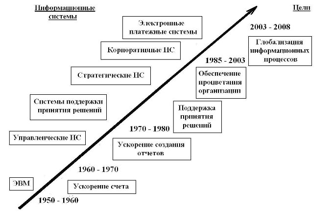

Тема 1.2  **ИСТОРИЯ РАЗВИТИЯ ИНФОРМАЦИОННЫХ СИСТЕМ** 

Развитие АИС можно рассматривать:  

1. С  позиций  развития  самой  техники,  появления  новой технической  базы, 

порождающей новые информационные потребности;  

2. С   точки   зрения   совершенствования   самих   автоматизированных 

информационных систем (АИС).  

Первый аспект предполагает два этапа: один – до появления ЭВМ, связанный с именами   изобретателей   первых   вычислительных   устройств,   таких   как   Б.  Паскаль,  П.Л. Чебышев, Ч. Беббидж и др.; второй – с развитием ЭВМ.  

Главный признак выделения нового поколения ЭВМ – элементная база.  

*Первое поколение ЭВМ* (1950-е гг.) было построено на базе электронных ламп и представлено моделями: ЭНИАК, "МЭСМ", "БЭСМ-1", "М-20", "Урал-1", "Минск- 1". Все эти  машины  имели  большие  размеры,  потребляли  большое  количество  электроэнергии,  имели   малое   быстродействие,   малый   объем   памяти   и  невысокую  надежность.  В экономических расчетах они не использовались.  

*Второе  поколение  ЭВМ*  (1960-е  гг.)  было  на  основе  полупроводников  и транзисторов:  "БЭСМ-6",  "Урал-14",  "Минск-32".  Использование  транзисторных элементов  в  качестве  элементной  базы  позволило  сократить  потребление электроэнергии,  уменьшить   размеры   отдельных   элементов   ЭВМ   и   всей  машины,  вырос  объем  памяти, появились  первые  дисплеи  и  др.  Эти  ЭВМ  уже  использовались   на   вычислительных  центрах  (ВЦ)  специалистами,  однако, пользователь  только  представлял  исходные  данные  для  их  обработки  на  ВЦ  и обычно спустя месяц получал результат сведения.  

*Третье  поколение  ЭВМ*  (1970-е  гг.)  было  на  малых  интегральных  схемах.  Его представители  –  IBM  360  (США),  ряд  ЭВМ  единой  системы  (ЕС  ЭВМ),  машины семейства  малых  ЭВМ  с  СМ  I  по  СМ  IV.  С  помощью  интегральных  схем  удалось уменьшить размеры ЭВМ, повысить их надежность и быстродействие. В АИС появились терминалы   –  устройства  ввода-вывода  данных  (пишущие  машинки   и/или   дисплеи,  соединенные  с  ЭВМ),  что  позволило  пользователю непосредственно общаться с ЭВМ.  

*Четвертое  поколение  ЭВМ*  (1980-е  гг.)  было на  больших  интегральных  схемах (БИС) и было представлено IBM 370 (США), ЕС-1045, ЕС-1065 и пр. Они представляли собой  ряд  программно-совместимых  машин  на  единой  элементной  базе,  единой конструкторско-технической  основе,  с  единой  структурой,  единой  системой  программного   обеспечения,   единым   унифицированным   набором  универсальных  устройств.  Широкое  распространение  получили  персональные (ПЭВМ), которые начали появляться  с  1976  г.  в  США  (An  Apple).  Они  не  требовали   специальных   помещений,  установки  систем  программирования, использовали  языки  высокого  уровня  и  общались  с  пользователем  в  диалоговом режиме.  

*В настоящее время* строятся ЭВМ на основе сверхбольших интегральных схем (СБИС).  Они  обладают  огромными  вычислительными  мощностями  и  имеют относительно низкую  стоимость.  Их  можно  представить  не  как  одну  машину,  а  как  вычислительную систему, связывающую ядро системы, которое представлено в виде супер-ЭВМ, и ПЭВМ на  периферии.  Это  позволяет  существенно  сократить  затраты  человеческого  труда  и эффективно использовать машины.  

Главной  тенденцией  развития  АИС  является  постоянное  стремление  к улучшению.  Оно  достигается  благодаря  совершенствованию  технических  и программных средств,  что  порождает  новые  информационные  потребности  и  ведет  к совершенствованию информационных систем.  

Различают несколько **поколений АИС**.  

*Первые информационные системы* появились в 50-х гг. В эти годы они были предназначены  для  обработки  счетов  и  расчета  зарплаты,  а  реализовывались  на электромеханических  бухгалтерских  счетных  машинах.  Это  приводило  к некоторому  сокращению  затрат и  времени  на подготовку  бумажных документов. Такие системы называются системами обработки транзакций. 

*2 этап  АИС*  (1960-1970  гг.)  строится  на  базе  вычислительных центров по принципу "одно предприятие – один центр обработки". Информация, полученная из них,  стала  применяться  для  периодической  отчетности  по  многим  параметрам. Появляются  системы  управленческих  отчетов  (СУО),  ориентированные  на менеджеров, принимающих решения. 

*3 этап  АИС*  (1970-1980  гг.)  характеризуется    переходом  к децентрализации  ИС.  Информационные  технологии  проникают  в  отделы,  службы предприятия.  Появились  пакеты  и  децентрализованные  базы  данных,  стали  внедряться двух, трехуровневые  модели  организации  систем  обработки  данных.  Эти  достижения создали условия для появления систем поддержки принятия решений. 

*4 этап АИС*  (1980-нач.1990  гг.) в офисах начали применять разнообразные компьютерные и телекоммуникационные технологии, которые расширили область применения  информационных  систем.  К таким технологиям относятся:  текстовая обработка,  настольное  издательство,  электронная  почта  и  др.  Интеграцию  этих технологий  в  одном  офисе  называют  офисной  информационной  системой.  ИС начинают широко использоваться в качестве средства управленческого контроля, поддерживающего  и  ускоряющего  процесс  принятия  решений.  Характерен  массовый  переход  к распределенной  сетевой обработке  на  базе  персональных  компьютеров  с объединением разрозненных рабочих мест в единую ИС.  

*Современные  информационные  системы*  на  предприятиях  создаются  на  основе  сетей   ЭВМ,   новых   технологий   принятия   управленческих   решений,  новых  методов решения профессиональных задач конечных пользователей и т.д. Характеризуется  сочетанием  централизованной  обработки  на  верхнем  уровне  с распределенной обработкой на  нижнем. 

История  развития  ИС  и  цели  их  использования  на  разных  периодах представлены на рисунке 1. 

Высокие  темпы  развития  информационных  технологий  в  настоящее  время обеспечивают  постоянное  совершенствование  систем  сбора  и  обработки  данных, способы  представления  данных  в  БД  и  БЗ,  создание  новых  методологий формирования  ХД  с  целью  повышения  эффективности  вырабатываемых управленческих  решений.  Новые  средства  и  возможности  информационных технологий  порождают  новые  запросы  пользователей  и  диалектический  процесс автоматизации  всех  аспектов  организационного  управления  формирует информационный бизнес в этой области. 

Рисунок 1 - Эволюция информационных систем 

Информационные  системы  становятся  стратегическим  источником информации  и  используются  на  всех  уровнях  организации  любого  профиля. Информационные  системы  этого  периода,  предоставляя  вовремя  нужную информацию,  помогают  организации  достичь  успеха  в  своей  деятельности, создавать новые товары и услуги, находить новые рынки сбыта, обеспечивать себе достойных партнеров, организовывать выпуск продукции по низкой цене и многое другое. 

В  последнее  время  появился  широкий  спектр  специализированных  ИС  - экономические  ИТ  (ЭИС), бухгалтерские  ИТ  (БУИС), банковские  ИТ  (БИС), ИТ рынка ценных бумаг, маркетинговые ИС (МИС) и т.п. 

***Задание:***  

Заполните таблицу. 

Какие возможности дает внедрение ИС в современных организациях?

Таблица - История развития ИС 

|Год |Элементная база |Вид АИС |Вид создаваемого информационного продукта |Цель использования АИС |
| - | :-: | - | :-: | :-: |
||||||

